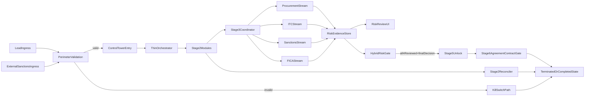

# StratCol Runtime Hardening Plan

## Delivery Model

- Implement this plan as verification-gated waves, not one large parallel refactor.
- Each wave should be small enough to fit comfortably inside an agent context window and should end with explicit proof before the next wave starts.
- Do not start a later wave just because the code compiles. Continue only after the current wave has:
  - passing targeted tests for the touched area
  - `bun run lint`
  - `bun run build`
  - runtime/browser verification for the affected UI or workflow path where feasible
- Prefer a safe rollout cadence over maximum throughput. If a wave introduces uncertainty in workflow state, timeouts, or adjudication behavior, pause and verify ground truth before proceeding.
- Parallelize only inside a wave where contracts are already fixed. Do not run multiple waves at once.

## Ground Truth

- The repo is already partly in the target architecture: `[inngest/functions/control-tower-workflow.ts](inngest/functions/control-tower-workflow.ts)` validates `onboarding/lead.created` and then delegates into the thin `[inngest/functions/control-tower/ControlTowerOrchestrator.ts](inngest/functions/control-tower/ControlTowerOrchestrator.ts)`, which sequences `executeStage1` through `executeStage6`.
- Termination is already canonical in runtime code through `[lib/services/kill-switch.service.ts](lib/services/kill-switch.service.ts)` and `[lib/services/terminate-run.service.ts](lib/services/terminate-run.service.ts)`; the main drift is in API/UI layers that still accept or render legacy `timeout` / `failed` vocabulary.
- Keep the contract gate canonical in Stage 6. `[inngest/functions/control-tower/stages/stage6_activation.ts](inngest/functions/control-tower/stages/stage6_activation.ts)` already uses a strict CEL predicate for `AGREEMENT_CONTRACT`, so the PRD's Stage 5 wording should be treated as outdated rather than moving the gate.
- Sanctions already have multiple provider paths in code: `[lib/services/agents/sanctions.agent.ts](lib/services/agents/sanctions.agent.ts)` uses OpenSanctions first and Firecrawl-backed list checks as fallback, including `[lib/services/firecrawl/checks/sanctions-list-un.ts](lib/services/firecrawl/checks/sanctions-list-un.ts)`, but adjudication is still effectively human-led through `[app/api/sanctions/route.ts](app/api/sanctions/route.ts)` and `[components/dashboard/sanctions/sanction-adjudication.tsx](components/dashboard/sanctions/sanction-adjudication.tsx)`. The plan should treat external sanctions ingestion as the future primary signal and keep the manual route as fallback/override.
- The risk-review surface already hints at independent check progression: `[app/api/risk-review/entities/route.ts](app/api/risk-review/entities/route.ts)` separately exposes `procurementStatus`, `itcStatus`, `sanctionStatus`, and `ficaStatus`, but `[inngest/functions/control-tower/stages/stage3_enrichment.ts](inngest/functions/control-tower/stages/stage3_enrichment.ts)` still bundles much of the orchestration and `[lib/risk-review/build-report-data.ts](lib/risk-review/build-report-data.ts)` still builds one merged report snapshot from partial JSON blobs.
- The persistence decision is now explicit: use a dedicated risk-checks table as the source of truth for per-check lifecycle, provenance, payload, and review state. Do not make `workflows.metadata` or `riskAssessments` the canonical store for these independent streams.
- Scope guard: this table should be purpose-built for the four current check families only: `PROCUREMENT`, `ITC`, `SANCTIONS`, and `FICA`. Do not generalize this refactor into an open-ended workflow evidence framework. What may evolve over time are the provider integrations, internal subchecks, and payload details inside each family, especially for sanctions.
- `[components/dashboard/risk-review/risk-review-detail.tsx](components/dashboard/risk-review/risk-review-detail.tsx)` and `[app/api/risk-review/route.ts](app/api/risk-review/route.ts)` currently tolerate missing data mainly via defaults, not via explicit section lifecycle states. The plan should move these views to a first-class partial-results model so each section can be pending, in progress, completed, failed, or manually reviewed without breaking the rest of the screen.
- The repo uses Drizzle/Turso, not Prisma. Status/model work must go through `[db/schema.ts](db/schema.ts)` and the existing SQL migrations, especially `[migrations/0000_initial.sql](migrations/0000_initial.sql)`.

## Target Shape

## Wave 1: Canonical Validation Boundary

- Consolidate duplicated lead/sanctions schemas across `[lib/validations/control-tower/onboarding-schemas.ts](lib/validations/control-tower/onboarding-schemas.ts)` and `[lib/validations/inngest-events.ts](lib/validations/inngest-events.ts)` into one canonical contract layer under `lib/validations/control-tower/`, then re-export where needed so runtime and tests cannot drift.
- Keep perimeter validation in `[inngest/functions/control-tower-workflow.ts](inngest/functions/control-tower-workflow.ts)`, but replace ad-hoc inline error handling with a shared validation helper that returns structured error details: event name, source system, workflow/applicant IDs when available, failed paths/messages, and the termination reason to emit.
- Introduce a provider-agnostic sanctions ingress contract and normalized evidence model. Normalize provider outputs from OpenSanctions and Firecrawl-backed checks into one canonical envelope with workflow/applicant IDs, provider name, source type, checked timestamp, normalized match data, raw payload snapshot, and adjudication status, so the workflow and dashboard do not couple directly to provider-specific response shapes.
- Add a dedicated external sanctions ingress next to the existing sanctions API. This path should `safeParse()` the canonical payload before any writes or AI calls, log structured failures, and be feature-flagged by provider/source. Start with the UN sanctions path as the first provider candidate, while keeping other providers dark or progressively enabled.
- Preserve `[app/api/sanctions/route.ts](app/api/sanctions/route.ts)` as the fallback/manual override path when external ingestion fails or needs human intervention, but make it write through the same normalized sanctions/adjudication model used by the external ingress.
- Design sanctions ingress for idempotency and provenance from day one: include a provider event/check ID, deterministic dedupe key, source metadata, and audit trail fields so retries or duplicate callbacks cannot create repeated kill-switchs, duplicate queue items, or inconsistent adjudication state.
- Reuse the current kill-switch reason model in `[lib/services/kill-switch.service.ts](lib/services/kill-switch.service.ts)` by adding any missing sanctions-specific or ingest-specific reason codes only once, then reflecting those codes in `[inngest/events.ts](inngest/events.ts)` and `[tests/inngest-events-validation.test.ts](tests/inngest-events-validation.test.ts)`.

## Wave 2: Stage 2 Timeout Enforcement And Zombie Cleanup

- Treat `[lib/constants/workflow-timeouts.ts](lib/constants/workflow-timeouts.ts)` as the single source of truth, but split generic `STAGE` / `REVIEW` values into explicit Stage 2 windows aligned to the PRD: facility application `14d`, approval/quote decision windows `30d`, with any shorter non-Stage-2 review gates remaining explicit and documented.
- Refactor `[inngest/functions/control-tower/stages/stage2_facilityApplication.ts](inngest/functions/control-tower/stages/stage2_facilityApplication.ts)` so every timeout path goes through shared helpers instead of repeating notify-then-terminate blocks. Persist the stage, wait gate, deadline basis, and timeout duration in audit payloads for later dashboard display.
- Add an idempotent reconciliation path for historical or already-detached zombies. Prefer a separate scheduled Inngest function or equivalent job that scans `[db/schema.ts](db/schema.ts)` `workflows` for Stage 2 runs stuck past their deadline and invokes the existing kill-switch path, rather than relying only on the live waiting run.
- Plan a one-time status migration that rewrites any `status = "timeout"` rows to `terminated` and backfills `terminationReason`. Use the most specific reason available from workflow events; fall back to `TIMEOUT_TERMINATION` only when no stronger evidence exists.

## Wave 3: Decouple Risk Evidence Streams And Hybrid Gate

- Split Stage 3 into four independently progressing evidence streams: Procurement, ITC, Sanctions, and FICA. Each stream should be able to start, finish, fail, retry, or require manual review without blocking the others from persisting their own data and surfacing in the UI.
- Introduce an explicit per-check state model instead of inferring readiness from scattered applicant fields, workflow fields, and event logs. Store this in a dedicated table keyed by workflow and one of the four fixed check types. Keep machine execution state and human review state separate, for example:
  - machine state: `pending | in_progress | completed | failed | manual_required`
  - review state: `pending | acknowledged | approved | rejected | not_required`
- Persist each check independently in that dedicated table so the risk-review APIs stop reverse-engineering status from loosely related fields. `riskAssessments` should become a derived aggregate/report snapshot, not the source of truth for per-check progress, and `workflows.metadata` should only hold supplemental display/cache data if truly needed.
- Keep the table narrowly scoped: top-level rows represent only the four check families, while provider-specific details, raw payloads, subcheck outcomes, and sanctions-source variability live inside typed payload/provenance fields rather than as new top-level workflow check types.
- Update `[app/api/risk-review/entities/route.ts](app/api/risk-review/entities/route.ts)` and `[app/api/risk-review/route.ts](app/api/risk-review/route.ts)` to read from that canonical per-check model rather than deriving statuses opportunistically from `applicants`, `workflows`, `riskAssessments`, and `workflowEvents`.
- Replace the merged-snapshot assumption in `[lib/risk-review/build-report-data.ts](lib/risk-review/build-report-data.ts)` with a section-aware report builder that returns both payload and status for Procurement, ITC, Sanctions, and FICA, so the UI can render real pending/in-progress/error/manual-review states instead of fake default values.
- Update `[components/dashboard/risk-review/risk-review-detail.tsx](components/dashboard/risk-review/risk-review-detail.tsx)` so each tabbed section can render independently with its own loading, pending, completed, failed, and manually-reviewed states. One section completing must not require the others to be present, and missing sections must never break the screen.
- Implement the chosen hybrid gate: each of the four checks gets its own review/acknowledgement state, and Stage 5 remains locked until all four are in reviewable terminal states and the Risk Manager has also recorded one final overall decision for the application.

## Wave 4: Finish The Partial Workflow Refactor

- Keep `[inngest/functions/control-tower/ControlTowerOrchestrator.ts](inngest/functions/control-tower/ControlTowerOrchestrator.ts)` thin. The real refactor target is Stage 2 and Stage 3, which still concentrate most of the workflow complexity.
- Split Stage 2 and Stage 3 into submodules under the existing control-tower folder, preserving the `executeStageN()` boundary while extracting smaller units such as facility dispatch/wait, pre-risk branch, quote branch, mandate retry/salvage, procurement stream, ITC stream, sanctions stream, FICA stream, and final report synthesis.
- Tighten the handoff contract in `[inngest/functions/control-tower/types.ts](inngest/functions/control-tower/types.ts)`. Replace loose context mutation with typed stage payloads so replay-safe data is either returned from steps or persisted explicitly.
- Follow the documented Inngest replay constraint from `[docs/solutions/logic-errors/inngest-replay-context-mutation-deadlock-ControlTower-20260225.md](docs/solutions/logic-errors/inngest-replay-context-mutation-deadlock-ControlTower-20260225.md)`: avoid making branching decisions from mutable in-step context that Inngest will not replay as side effects.
- Preserve the Stage 6 `AGREEMENT_CONTRACT` predicate in `[inngest/functions/control-tower/stages/stage6_activation.ts](inngest/functions/control-tower/stages/stage6_activation.ts)` and ensure all related event producers continue emitting the same `formType` consistently.

## Wave 5: Status Semantics And Dashboard Alignment

- Make `terminated` first-class in the workflow UI. Update `[app/(authenticated)/dashboard/workflows/page.tsx](app/%28authenticated%29/dashboard/workflows/page.tsx)` and `[components/dashboard/workflow-table.tsx](components/dashboard/workflow-table.tsx)` so `terminated` is no longer normalized to `failed`, and add the dedicated termination reason/state surface requested by the PRD.
- Align notifications and activity views with the real runtime model by updating components that still know about `timeout` but not `terminated`, including the workflow table, notifications panel, and activity feed surfaces identified during research.
- Remove stale API unions in `[app/api/workflows/route.ts](app/api/workflows/route.ts)` so newly created or updated workflows use real database statuses (`pending`, `processing`, `awaiting_human`, `paused`, `completed`, `failed`, `terminated`) instead of `in_progress` / `timeout` drift.
- Replace or deliberately de-scope the destructive delete behavior in `[app/api/workflows/[id]/reject/route.ts](app/api/workflows/%5Bid%5D/reject/route.ts)`, because deleting workflows conflicts with the requirement to surface terminated runs and their audit trail in internal tooling.

## Verification And Rollout

- Treat verification as a hard gate between waves, not as one final step at the end of the full refactor.
- Extend `[tests/inngest-events-validation.test.ts](tests/inngest-events-validation.test.ts)` with canonical lead + external sanctions payload coverage, updated reason codes, and backfill-safe termination semantics.
- Add the first stage-level tests for the Control Tower flow. Prioritize orchestrator short-circuiting, Stage 2 timeout helpers, independent Procurement/ITC/Sanctions/FICA stream completion, hybrid gate behavior, and the Stage 6 `AGREEMENT_CONTRACT` predicate; there are currently no dedicated stage tests in `tests/`.
- Verify in this order: targeted Bun tests, `bun run lint`, `bun run build`, then runtime/browser validation on the workflow dashboard, risk-review queue, risk-review detail tabs, and applicant detail pages to prove partial-section rendering, pending states, hybrid gating, termination reason visibility, and active-queue hygiene.
- Roll out behind environment/product-slice flags: validation first in non-prod, then Stage 2 reconciliation/backfill, then UI/status cleanup. Monitor for spikes in validation failures or unexpected terminations during the canary window.
- Roll out sanctions ingress in layers: first land the canonical schema, normalized persistence, and manual fallback path; then enable the UN-based external source; then progressively enable OpenSanctions and the remaining providers behind flags once payload quality, dedupe behavior, and adjudication UX are stable.

