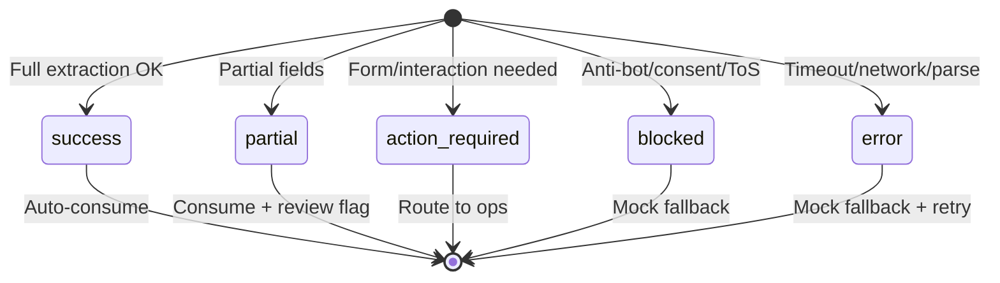

# Firecrawl Check Agent Contracts

> Concrete contract specification for Firecrawl-viable verification checks. Aligned to existing `externalChecks` and sanctions conventions.

## Scope

**In scope:**
- `industryRegulator` (high-confidence): NCR, CFDC, SAICA, CIBA, FPI, FISA, RMI, PSIRA, SACE, DOE
- `sanctionsEvidenceEnrichment`: OFAC, UN 1267, FIC TFS
- `socialReputation`: HelloPeter
- `mediumConfidenceRegulator`: FSCA, HPCSA, SAIPA, LPC

**Out of scope:** BizPortal, SARS VAT, XDS, LexisNexis, EFS24, Google Maps, PPRA

---

## 1. Base Contracts

### 1.1 CheckRequestBase

Canonical input envelope for all Firecrawl-backed checks.

| Field | Type | Required | Description |
|-------|------|----------|-------------|
| `applicantId` | `number` | Yes | Applicant identifier |
| `workflowId` | `number` | Yes | Workflow context |
| `applicantData` | `ApplicantData` | Yes | Entity/individual details |
| `industry` | `string` | No | Used to select regulator provider |
| `provider` | `ProviderCode` | No | Override provider when known |

```ts
interface ApplicantData {
  companyName: string;
  contactName?: string;
  registrationNumber?: string;
  industry?: string;
  countryCode?: string;
  address?: string;
  directors?: Array<{ name: string; idNumber?: string; nationality?: string }>;
}
```

### 1.2 CheckResultBase

Canonical output envelope compatible with `externalChecks.*.result`.

| Field | Type | Required | Description |
|-------|------|----------|-------------|
| `status` | `"mock" \| "live"` | Yes | Outer status (existing convention) |
| `result` | `ResultPayload` | Yes | Family-specific payload |
| `runtimeState` | `RuntimeState` | Yes | Inner fallback state |
| `metadata` | `CheckMetadata` | Yes | Audit and traceability |

### 1.3 ResultPayload (family-specific)

See family contracts below. Common shape: `checked`, `passed`, `evidence?`, `failureDetail?`, `checkedAt`.

### 1.4 CheckMetadata

| Field | Type | Required | Description |
|-------|------|----------|-------------|
| `checkId` | `string` | Yes | Format: `{family}-{workflowId}-{timestamp}` |
| `checkedAt` | `string` | Yes | ISO 8601 timestamp |
| `expiresAt` | `string` | No | ISO 8601; sanctions/regulator typically 30 days |
| `dataSource` | `string` | Yes | e.g. `"Firecrawl + NCR"`, `"Mock Regulator v1.0"` |
| `provider` | `ProviderCode` | Yes | Provider identifier |
| `confidenceTier` | `"high_confidence" \| "medium_confidence"` | Yes | Reliability tier |
| `latencyMs` | `number` | No | Scrape duration |

### 1.5 EvidenceItem

Normalized evidence record for sanctions and regulator checks.

| Field | Type | Required | Description |
|-------|------|----------|-------------|
| `source` | `string` | Yes | e.g. `"OFAC"`, `"NCR"` |
| `sourceUrl` | `string` | No | Scraped page URL |
| `matchType` | `"EXACT" \| "PARTIAL" \| "FUZZY"` | No | For sanctions |
| `matchedName` | `string` | No | Matched entity/person name |
| `confidence` | `number` | No | 0–100 |
| `listEntryId` | `string` | No | Direct link ID (OFAC, UN, FIC) |
| `registrationStatus` | `string` | No | For regulators: e.g. `"Registered"`, `"Lapsed"` |
| `details` | `Record<string, unknown>` | No | Provider-specific extra fields |

### 1.6 FailureDetail

| Field | Type | Required | Description |
|-------|------|----------|-------------|
| `code` | `RuntimeState` | Yes | Failure state |
| `message` | `string` | Yes | Human-readable reason |
| `retryPolicy` | `"immediate" \| "backoff" \| "manual"` | No | Recommended retry |
| `blockedReason` | `string` | No | Anti-bot, consent, ToS, etc. |

### 1.7 RuntimeState (fallback state)

| Value | Meaning | Escalation |
|-------|---------|------------|
| `success` | Deterministic extraction succeeded with required fields | Auto-consume evidence |
| `partial` | Page reachable; some required fields missing | Consume + raise review flag |
| `action_required` | Scraping requires form submit / dynamic interaction | No auto-pass; route to compliance ops |
| `blocked` | Anti-bot, access denied, consent wall, ToS restriction | Fallback to mock with reason |
| `error` | Timeout, network, parser, or runtime failure | Fallback to mock with retry policy |

---

## 2. Family Contracts

### 2.1 IndustryRegulatorCheckRequest / Result

**Request:** Extends `CheckRequestBase`. `industry` or `provider` required to select regulator.

**Result payload:**

| Field | Type | Required | Description |
|-------|------|----------|-------------|
| `checked` | `boolean` | Yes | Whether check ran |
| `passed` | `boolean` | Yes | Entity/person verified on register |
| `evidence` | `EvidenceItem[]` | No | Matched records |
| `failureDetail` | `FailureDetail` | No | When `runtimeState` not `success` |
| `checkedAt` | `string` | Yes | ISO timestamp |
| `providerPayload` | `RegulatorProviderPayload` | No | Provider-specific slice |

**Provider codes:** `NCR`, `CFDC`, `SAICA`, `CIBA`, `FPI`, `FISA`, `RMI`, `PSIRA`, `SACE`, `DOE`

**Provider-specific payloads (RegulatorProviderPayload):**

- **NCR**: `{ category: "debt_counsellor" | "credit_provider" | "credit_bureau" | "adr" | "pda"; status: "Registered" | "Lapsed" | "Cancelled" | "Voluntary Cancelled"; registerUrl: string }`
- **CFDC**: `{ status: "Registered"; registerUrl: string }`
- **SAICA**: `{ designation: "CA(SA)" | "AGA(SA)" | "AT(SA)"; memberNumber?: string }`
- **CIBA**: `{ memberNumber?: string; status?: string }`
- **FPI**: `{ practiceAreas?: string[]; province?: string; city?: string }`
- **FISA**: `{ memberNumber?: string; company?: string; fpsaStatus?: string }`
- **RMI**: `{ province?: string; category?: string; association?: string }`
- **PSIRA**: `{ registrationNumber?: string; status?: string; verificationUrl?: string }`
- **SACE**: `{ registrationStatus?: string; verifyUrl?: string }`
- **DOE**: `{ programme?: "ECD" | "EMIS"; downloadUrl?: string }`

### 2.2 SanctionsEvidenceEnrichmentRequest / Result

**Request:** Extends `CheckRequestBase`. `entityName`, `entityType`, `countryCode`, `registrationNumber?`, `directors?` used for search context.

**Result payload:**

| Field | Type | Required | Description |
|-------|------|----------|-------------|
| `checked` | `boolean` | Yes | Whether check ran |
| `passed` | `boolean` | Yes | No blocking match (aligned to sanctions.agent) |
| `evidence` | `EvidenceItem[]` | Yes | Enriched matches from OFAC/UN/FIC |
| `failureDetail` | `FailureDetail` | No | When `runtimeState` not `success` |
| `checkedAt` | `string` | Yes | ISO timestamp |
| `sourcesChecked` | `string[]` | Yes | e.g. `["OFAC", "UN_1267", "FIC_TFS"]` |
| `deepLinks` | `Array<{ label: string; url: string; source: string }>` | Yes | Compatible with sanctions API `buildDeepLinks` |

**Provider codes:** `OFAC`, `UN_1267`, `FIC_TFS`

**Provider-specific payloads:**

- **OFAC**: `{ listEntryId?: string; detailsUrl?: string; score?: number; program?: string }`
- **UN_1267**: `{ permanentRefNum?: string; narrativeSummaryUrl?: string }`
- **FIC_TFS**: `{ noticeId?: string; noticeNumber?: string; displayNoticeUrl?: string }`

### 2.3 SocialReputationCheckRequest / Result

**Request:** Extends `CheckRequestBase`. `companyName` or `contactName` used for search.

**Result payload:**

| Field | Type | Required | Description |
|-------|------|----------|-------------|
| `checked` | `boolean` | Yes | Whether check ran |
| `passed` | `boolean` | Yes | No critical complaints / acceptable rating |
| `evidence` | `EvidenceItem[]` | No | Reviews, complaints, compliments |
| `failureDetail` | `FailureDetail` | No | When `runtimeState` not `success` |
| `checkedAt` | `string` | Yes | ISO timestamp |
| `summaryRating` | `number` | No | 0–100 if extractable |
| `complaintCount` | `number` | No | Count if extractable |
| `complimentCount` | `number` | No | Count if extractable |

**Provider codes:** `HELLOPETER`

### 2.4 MediumConfidenceRegulatorCheckRequest / Result

**Request:** Extends `CheckRequestBase`. `provider` required: `FSCA`, `HPCSA`, `SAIPA`, `LPC`.

**Result payload:** Same shape as `IndustryRegulatorCheckResult` but:

- `runtimeState` often `action_required` when form submission is needed
- `confidenceTier` = `"medium_confidence"`
- `failureDetail.retryPolicy` = `"manual"` when action_required

**Provider-specific notes:**

- **FSCA**: Entity-persons search; may return offline/app shell; `action_required` when form interaction needed
- **HPCSA**: iRegister form; requires registration number, fullname, register type; `action_required` by default
- **SAIPA**: Verify member form; minimal response without submission; `action_required` by default
- **LPC**: List of legal practitioners; may need deeper path; `partial` or `action_required` depending on content

---

## 3. Fallback and Escalation Semantics

### 3.1 State machine



### 3.2 Escalation mapping

| runtimeState | Auto-consume evidence | Raise review flag | Route to ops |
|--------------|------------------------|-------------------|--------------|
| `success` | Yes | No | No |
| `partial` | Yes | Yes | Optional |
| `action_required` | No | Yes | Yes |
| `blocked` | No | Yes | Optional |
| `error` | No | Yes | Optional |

### 3.3 Mock fallback output

When `blocked` or `error`:

```ts
{
  status: "mock",
  result: {
    checked: true,
    passed: true,
    mockReason: "Firecrawl {provider} check failed: {failureDetail.message}",
    failureDetail: { ... },
    checkedAt: "..."
  },
  runtimeState: "error" | "blocked",
  metadata: { dataSource: "Mock Fallback (Firecrawl unavailable)", ... }
}
```

---

## 4. Compatibility Mapping

### 4.1 externalChecks compatibility

Current shape in `aggregated-analysis.service.ts`:

```ts
industryRegulator: { status: "mock" | "live"; result?: Record<string, unknown> }
```

**Normalized output** from Firecrawl contracts must produce:

```ts
{
  status: "mock" | "live",  // live when Firecrawl ran successfully
  result: {
    checked: boolean,
    passed: boolean,
    mockReason?: string,      // present when fallback
    checkedAt: string,
    runtimeState?: RuntimeState,
    evidence?: EvidenceItem[],
    failureDetail?: FailureDetail,
    providerPayload?: Record<string, unknown>,
    // family-specific fields
  }
}
```

### 4.2 Sanctions API compatibility

Sanctions API (`app/api/sanctions/route.ts`) expects from agent output:

| API field | Contract source |
|-----------|-----------------|
| `sanctionListSource` | `evidence[].source` or `"OFAC/UN 1267/FIC"` |
| `matchConfidence` | `evidence[].confidence` |
| `matchedEntity` | `evidence[].matchedName` |
| `matchedListId` / `listEntryId` | `evidence[].listEntryId` |
| `deepLinks` | `result.deepLinks` from `SanctionsEvidenceEnrichmentResult` |

**buildDeepLinks** enhancement: When `evidence[].listEntryId` exists, prepend direct link:

- OFAC: `https://sanctionssearch.ofac.treas.gov/Details.aspx?id={listEntryId}`
- UN: Use UN entry ID if provider exposes it
- FIC: Use `displayNoticeUrl` or notice-specific URL from FIC payload

### 4.3 New slots for externalChecks (optional)

To add Firecrawl-backed checks without replacing existing stubs:

```ts
externalChecks: {
  // existing
  xdsCreditCheck: ...,
  lexisNexisProcure: ...,
  bizPortalRegistration: ...,
  efs24IdAvsr: ...,
  sarsVatSearch: ...,
  industryRegulator: ...,  // Can be upgraded to Firecrawl contract
  // new (optional)
  sanctionsEvidenceEnrichment?: { status: "mock" | "live"; result?: SanctionsEvidenceEnrichmentResult };
  socialReputation?: { status: "mock" | "live"; result?: SocialReputationCheckResult };
  mediumConfidenceRegulator?: { status: "mock" | "live"; result?: MediumConfidenceRegulatorCheckResult };
}
```

---

## 5. Acceptance Criteria and TTL

### 5.1 Per-provider requirements

| Provider | Confidence | TTL (expiresAt) | Required fields for success |
|----------|------------|-----------------|-----------------------------|
| NCR | high | 30 days | `registrationStatus`, `registerUrl` |
| CFDC | high | 30 days | `status`, `registerUrl` |
| SAICA | high | 30 days | `designation` or member confirmation |
| CIBA | high | 30 days | `status` or member confirmation |
| FPI | high | 30 days | At least one of: practiceAreas, province, city |
| FISA | high | 30 days | `memberNumber` or company match |
| RMI | high | 30 days | Province/category or member match |
| PSIRA | high | 30 days | `registrationNumber` or status |
| SACE | high | 30 days | `registrationStatus` |
| DOE | high | 30 days | Programme and download/list availability |
| OFAC | high | 7 days | `evidence` array (clear or matches) |
| UN_1267 | high | 7 days | `evidence` array |
| FIC_TFS | high | 7 days | `evidence` array |
| HelloPeter | high | 14 days | `summaryRating` or `complaintCount`/`complimentCount` |
| FSCA | medium | 30 days | `action_required` acceptable |
| HPCSA | medium | 30 days | `action_required` default |
| SAIPA | medium | 30 days | `action_required` default |
| LPC | medium | 30 days | `partial` or `action_required` |

### 5.2 Retry policy

| runtimeState | Retry | Notes |
|--------------|-------|-------|
| `success` | N/A | No retry |
| `partial` | Optional backoff | May improve with actions |
| `action_required` | Manual | Human or automation queue |
| `blocked` | Backoff (hours) | Anti-bot may relax |
| `error` | Immediate or backoff | Transient vs persistent |

### 5.3 Risks (captured in spec)

- Source pages with form/dynamic workflows may not produce deterministic extraction every run
- Anti-bot or consent behavior can vary by geography and time
- Some provider pages return sparse content unless interaction steps are executed
