# Inngest Workflow Audit Report

**Generated**: 2026-03-02
**Scope**: Full audit of `inngest/` directory, all workflow functions, event schemas, guards, AI agent tasks, and approval gates

---

## 1. Workflow Functions Summary

| Function ID                    | Name                              | Trigger Event             | cancelOn                                                                   | Retries |
| ------------------------------ | --------------------------------- | ------------------------- | -------------------------------------------------------------------------- | ------- |
| `stratcol-control-tower`       | StratCol Control Tower Onboarding | `onboarding/lead.created` | `workflow/terminated`, `sanction/confirmed` (both match `data.workflowId`) | 3       |
| `stratcol-kill-switch-handler` | Kill Switch Handler               | `workflow/terminated`     | None                                                                       | default |
| `fica-document-aggregator`     | FICA Document Aggregator          | `document/uploaded`       | None                                                                       | default |

**Files**:

- `[inngest/functions/control-tower-workflow.ts](inngest/functions/control-tower-workflow.ts)` (2734 lines) -- main workflow + kill switch handler
- `[inngest/functions/document-aggregator.ts](inngest/functions/document-aggregator.ts)` (109 lines) -- FICA document aggregation
- `[inngest/index.ts](inngest/index.ts)` -- exports `functions` array for `serve()`
- `[inngest/client.ts](inngest/client.ts)` -- Inngest client (`id: "stratcol-onboard"`)
- `[inngest/events.ts](inngest/events.ts)` -- 60+ typed event definitions
- `[app/api/inngest/route.ts](app/api/inngest/route.ts)` -- Next.js serve handler

---

## 2. Step Inventory

### controlTowerWorkflow (`stratcol-control-tower`)

#### Stage 1: Lead Capture

| Step Type | Step ID         | Purpose                        |
| --------- | --------------- | ------------------------------ |
| run       | `stage-1-start` | Set status=processing, stage=1 |

#### Stage 2: Facility, Pre-Risk and Quote

| Step Type    | Step ID                                 | Purpose                                                  |
| ------------ | --------------------------------------- | -------------------------------------------------------- |
| run          | `stage-2-start`                         | Set status=processing, stage=2                           |
| run          | `send-facility-application`             | Create form instance, email applicant                    |
| run          | `stage-2-awaiting-facility-application` | Set status=awaiting_human                                |
| waitForEvent | `wait-facility-app`                     | `form/facility.submitted`, timeout=14d                   |
| run          | `notify-am-facility-timeout`            | Timeout notification                                     |
| run          | `notify-am-facility-submitted`          | Success notification                                     |
| run          | `sales-evaluation`                      | Check mandate volume vs threshold, emit sales events     |
| run          | `pre-risk-sanctions-check`              | Run sanctions (if issues found)                          |
| run          | `stage-2-awaiting-pre-risk-approval`    | Set awaiting_human for pre-risk                          |
| waitForEvent | `wait-pre-risk-approval`                | `risk/pre-approval.decided`, timeout=7d                  |
| run          | `notify-am-pre-risk-approval-timeout`   | Timeout notification                                     |
| run          | `pre-risk-declined-notify`              | Decline notification + kill switch                       |
| waitForEvent | `wait-pre-risk-evaluation`              | `risk/pre-evaluation.decided`, timeout=7d (conditional)  |
| run          | `notify-am-pre-risk-eval-timeout`       | Timeout notification                                     |
| run          | `pre-risk-evaluation-declined-notify`   | Decline notification                                     |
| run          | `pre-risk-approval-complete`            | Persist pre-risk outcome                                 |
| run          | `determine-mandate`                     | Resolve business type, map documents                     |
| run          | `ai-generate-quote`                     | Generate AI quotation via `generateQuote()`              |
| run          | `notify-manager-quote`                  | Notify manager for review                                |
| run          | `stage-2-awaiting-quote-approval`       | Set awaiting_human                                       |
| waitForEvent | `wait-quote-approval`                   | `quote/approved`, timeout=30d                            |
| run          | `notify-am-quote-timeout`               | Timeout notification                                     |
| run          | `quote-timeout`                         | Set status=timeout                                       |
| run          | `send-quote-to-applicant`               | Send quote for signing                                   |
| run          | `stage-2-awaiting-quote-signature`      | Set awaiting_human                                       |
| waitForEvent | `wait-quote-response`                   | `quote/responded`, timeout=30d                           |
| run          | `notify-am-quote-response-timeout`      | Timeout notification                                     |
| run          | `quote-declined-notify`                 | Decline notification                                     |
| run          | `send-mandate-request`                  | Send document upload links, conditional call-centre form |
| run          | `stage-2-awaiting-mandates`             | Set awaiting_human                                       |
| waitForEvent | `wait-mandate-docs`                     | `upload/fica.received`, timeout=7d                       |
| run          | `tier-1-escalation`                     | Escalation at retry 4                                    |
| run          | `tier-2-escalation`                     | Final warning at retry 7                                 |
| run          | `tier-3-salvage-state`                  | Salvage at retry 8                                       |
| sleep        | `wait-salvage`                          | 48h wait for salvage                                     |
| run          | `check-salvage-outcome`                 | Check `applicants.isSalvaged`                            |
| run          | `mandate-retry-${N}`                    | Dynamic retry step (up to 8)                             |
| waitForEvent | `wait-mandate-docs-retry-${N}`          | Dynamic retry wait, 7d each                              |
| run          | `mandate-verified`                      | Emit `mandate/verified`, return documentsComplete        |
| run          | `notify-am-mandate-docs-uploaded`       | Success notification                                     |

#### Stage 3: Procurement and AI (Parallel)

| Step Type    | Step ID                               | Purpose                                                                                  |
| ------------ | ------------------------------------- | ---------------------------------------------------------------------------------------- |
| run          | `stage-3-start`                       | Set status=processing, stage=3                                                           |
| run          | `emit-business-type-event`            | Emit `onboarding/business-type.determined`                                               |
| run          | `capture-state-lock-version`          | Snapshot state lock version for Ghost Process Guard                                      |
| run          | `stream-a-procurement`                | Parallel: Run `runProcureCheck()`, ghost process guard                                   |
| run          | `stream-b-fica-and-ai`                | Parallel: FICA document request, ghost process guard                                     |
| run          | `log-state-collision-handled`         | Log collision if detected                                                                |
| run          | `stage-3-awaiting-procurement-review` | Set awaiting_human for procurement                                                       |
| waitForEvent | `wait-procurement-decision`           | `risk/procurement.completed`, timeout=7d (conditional)                                   |
| run          | `notify-am-procurement-timeout`       | Timeout notification + kill switch                                                       |
| waitForEvent | `wait-fica-docs`                      | `upload/fica.received`, timeout=14d (conditional)                                        |
| run          | `notify-am-fica-timeout`              | Timeout notification                                                                     |
| run          | `notify-am-fica-docs-uploaded`        | Success notification                                                                     |
| run          | `resume-processing-after-review`      | Set status=processing, stage=3                                                           |
| run          | `run-main-itc-and-sanctions`          | Parallel: `performITCCheck()` + `runSanctionsForWorkflow("itc_main")`                    |
| run          | `run-ai-analysis`                     | Parallel: `performAggregatedAnalysis()` on uploaded docs                                 |
| run          | `reporter-agent-synthesis`            | Merge ITC + AI results, emit `agent/analysis.aggregated` + `reporter/analysis.completed` |
| run          | `enter-sanction-pause`                | Set status=paused if sanction hit                                                        |
| waitForEvent | `wait-sanction-clearance`             | `sanction/cleared`, timeout=30d                                                          |
| run          | `resume-from-sanction-pause`          | Resume after clearance                                                                   |

#### Stage 4: Risk Review

| Step Type    | Step ID                                  | Purpose                                                          |
| ------------ | ---------------------------------------- | ---------------------------------------------------------------- |
| run          | `stage-4-start`                          | Set status=processing, stage=4                                   |
| run          | `notify-final-review`                    | Notify Risk Manager                                              |
| run          | `stage-4-awaiting-review`                | Set awaiting_human                                               |
| waitForEvent | `wait-risk-decision`                     | `risk/decision.received`, timeout=7d                             |
| run          | `notify-am-risk-review-timeout`          | Timeout notification + kill switch                               |
| run          | `risk-declined-notify-applicant`         | Decline notification + kill switch                               |
| run          | `check-high-risk`                        | Check `applicants.riskLevel === "red"`                           |
| run          | `notify-financial-statements-required`   | High-risk notification (conditional)                             |
| run          | `stage-4-awaiting-financial-statements`  | Set awaiting_human (conditional)                                 |
| waitForEvent | `wait-financial-statements`              | `risk/financial-statements.confirmed`, timeout=14d (conditional) |
| run          | `notify-am-financial-statements-timeout` | Timeout notification                                             |
| run          | `log-financial-statements-confirmed`     | Log confirmation                                                 |

#### Stage 5: Contract

| Step Type    | Step ID                               | Purpose                                |
| ------------ | ------------------------------------- | -------------------------------------- |
| run          | `stage-5-start`                       | Set status=processing, stage=5         |
| run          | `notify-contract-review`              | Notify AM to review AI contract        |
| run          | `stage-5-awaiting-contract-review`    | Set awaiting_human                     |
| waitForEvent | `wait-contract-reviewed`              | `contract/draft.reviewed`, timeout=7d  |
| run          | `notify-am-contract-review-timeout`   | Timeout notification                   |
| run          | `send-final-docs`                     | Send contract + ABSA form to client    |
| run          | `stage-5-awaiting-docs`               | Set awaiting_human                     |
| waitForEvent | `wait-contract-decision`              | `form/decision.responded`, timeout=7d  |
| run          | `notify-am-contract-decision-timeout` | Timeout notification                   |
| run          | `contract-declined-notify-applicant`  | Decline notification                   |
| waitForEvent | `wait-absa-completed`                 | `form/absa-6995.completed`, timeout=7d |
| run          | `notify-am-absa-timeout`              | Timeout notification                   |

#### Stage 6: Final Approval (Two-Factor)

| Step Type    | Step ID                           | Purpose                                         |
| ------------ | --------------------------------- | ----------------------------------------------- |
| run          | `stage-6-start`                   | Set status=processing, stage=6                  |
| run          | `notify-two-factor-approval`      | Notify both approvers                           |
| run          | `stage-6-awaiting-approvals`      | Set awaiting_human                              |
| waitForEvent | `wait-risk-manager-approval`      | `approval/risk-manager.received`, timeout=7d    |
| waitForEvent | `wait-account-manager-approval`   | `approval/account-manager.received`, timeout=7d |
| run          | `notify-am-final-risk-timeout`    | Timeout notification                            |
| run          | `notify-am-final-account-timeout` | Timeout notification                            |
| run          | `persist-approvals`               | Write both approvals to DB                      |
| run          | `emit-final-approval`             | Emit `onboarding/final-approval.received`       |
| run          | `workflow-complete`               | Set status=completed, stage=6                   |

### killSwitchHandler (`stratcol-kill-switch-handler`)

| Step Type | Step ID           | Purpose                                                |
| --------- | ----------------- | ------------------------------------------------------ |
| run       | `log-termination` | Insert `kill_switch_handled` event to `workflowEvents` |

### documentAggregator (`fica-document-aggregator`)

| Step Type | Step ID                | Purpose                                                    |
| --------- | ---------------------- | ---------------------------------------------------------- |
| run       | `fetch-all-documents`  | Fetch all documents for applicant                          |
| run       | `fetch-applicant-info` | Fetch applicant for business type resolution               |
| run       | `emit-fica-received`   | Emit `upload/fica.received` when all required docs present |

---

## 3. Applicant Checks and Validations

### Applicant Guards

- **Line 214-218** (`control-tower-workflow.ts`): Applicant lookup at workflow start; throws if not found
- **Line 484-489**: Applicant lookup before sending facility application
- **Line 818-823**: Applicant lookup for mandate mapping
- **Line 1014-1019**: Applicant lookup for quote dispatch
- **Line 1101-1106**: Applicant lookup for mandate request
- **Line 1859-1860**: Applicant lookup for AI analysis
- **Line 2197-2201**: Applicant lookup for high-risk check
- **Line 2355-2360**: Applicant lookup for contract dispatch
- **Document aggregator line 38-46**: Applicant lookup for business type resolution

### Kill Switch (`guardKillSwitch`)

Called before **35+ steps** throughout the workflow. Defined at line 117-124; calls `isWorkflowTerminated()` and throws `NonRetriableError` if workflow status is `"terminated"`.

Key locations where `isWorkflowTerminated` is called directly (instead of via `guardKillSwitch`):

- Line 1453: Stream A (procurement) -- checks before running procurement
- Line 1547: Stream B (FICA) -- checks before requesting documents

### Ghost Process Guard (State Lock)

- **Line 1428-1434** (`capture-state-lock-version`): Captures baseline `stateLockVersion` before parallel streams
- **Line 1465-1477** (Stream A): Compares current lock version; calls `handleStateCollision()` if changed
- **Line 1554-1571** (Stream B): Same pattern
- Services: `[lib/services/state-lock.service.ts](lib/services/state-lock.service.ts)` lines 110-141 (`getStateLockInfo`) and 238-254 (`handleStateCollision`)

### Input Validation

- **No Zod validation** on Inngest event payloads within workflow handlers. Event `data` fields (`applicantId`, `workflowId`, etc.) are used directly without `.parse()` or `.safeParse()`.
- Line 237: `JSON.parse(latestSanctionsEvent.payload)` -- no Zod schema
- Line 939: `JSON.parse(quote.details)` -- no Zod schema
- Zod validation exists only in API route handlers (e.g., `PreRiskDecisionSchema` in `app/api/risk-decision/pre/route.ts`)

---

## 4. AI Agent Tasks

| Step                                   | Agent/Service                                                                   | File                                                 | Event Emitted                                              | Result Used For                                             |
| -------------------------------------- | ------------------------------------------------------------------------------- | ---------------------------------------------------- | ---------------------------------------------------------- | ----------------------------------------------------------- |
| `pre-risk-sanctions-check` (Stage 2)   | `performSanctionsCheck` via `runSanctionsForWorkflow("pre_risk")`               | `lib/services/agents/sanctions.agent.ts`             | `agent/sanctions.completed` (via workflowEvent log)        | Pre-risk path: determines if pre-risk approval needed       |
| `stream-a-procurement` (Stage 3)       | `runProcureCheck` (alias for `analyzeRisk`)                                     | `lib/services/risk.service.ts`                       | N/A (logged as `procurement_check_completed`)              | Determines if manual procurement review needed              |
| `run-main-itc-and-sanctions` (Stage 3) | `performITCCheck` + `runSanctionsForWorkflow("itc_main", { allowReuse: true })` | `lib/services/itc.service.ts` + `sanctions.agent.ts` | N/A (logged as `itc_check_completed`)                      | ITC credit score + sanctions risk combined                  |
| `run-ai-analysis` (Stage 3)            | `performAggregatedAnalysis`                                                     | `lib/services/agents/aggregated-analysis.service.ts` | N/A (returned for synthesis)                               | Multi-agent document analysis (validation, risk, sanctions) |
| `reporter-agent-synthesis` (Stage 3)   | Merges ITC + AI results                                                         | In-workflow                                          | `agent/analysis.aggregated`, `reporter/analysis.completed` | Drives risk review path and sanction pause logic            |

**Sanctions Reuse Logic**: The `runSanctionsForWorkflow` helper (line 206-455) supports result reuse within a 7-day window (`SANCTIONS_RECHECK_WINDOW_MS`). The "itc_main" call uses `allowReuse: true`; the "pre_risk" call uses `allowReuse: false`.

**Graceful Degradation**: Both sanctions and procurement checks have try/catch blocks that log errors, flag manual review requirements, and continue the workflow rather than failing catastrophically.

---

## 5. Human Approval Gates

| Gate Step                       | Event                                 | Timeout                       | Timeout Action                                                                 |
| ------------------------------- | ------------------------------------- | ----------------------------- | ------------------------------------------------------------------------------ |
| `wait-facility-app`             | `form/facility.submitted`             | 14d (`STAGE_TIMEOUT`)         | Return timeout, workflow ends                                                  |
| `wait-pre-risk-approval`        | `risk/pre-approval.decided`           | 7d (`REVIEW_TIMEOUT`)         | Return timeout, workflow ends                                                  |
| `wait-pre-risk-evaluation`      | `risk/pre-evaluation.decided`         | 7d (`REVIEW_TIMEOUT`)         | Return timeout, workflow ends (conditional)                                    |
| `wait-quote-approval`           | `quote/approved`                      | 30d (`WORKFLOW_TIMEOUT`)      | Set status=timeout, workflow ends                                              |
| `wait-quote-response`           | `quote/responded`                     | 30d (`WORKFLOW_TIMEOUT`)      | Return timeout, workflow ends                                                  |
| `wait-mandate-docs`             | `upload/fica.received`                | 7d (per cycle, max 8 retries) | Tiered escalation: Tier 1 (retry 4), Tier 2 (retry 7), Salvage (retry 8 + 48h) |
| `wait-procurement-decision`     | `risk/procurement.completed`          | 7d (`REVIEW_TIMEOUT`)         | Kill switch (PROCUREMENT_DENIED), workflow terminated                          |
| `wait-fica-docs`                | `upload/fica.received`                | 14d (`STAGE_TIMEOUT`)         | Return timeout, workflow ends                                                  |
| `wait-sanction-clearance`       | `sanction/cleared`                    | 30d                           | Return terminated (note: `sanction/confirmed` handled via `cancelOn`)          |
| `wait-risk-decision`            | `risk/decision.received`              | 7d (`REVIEW_TIMEOUT`)         | Kill switch (TIMEOUT_TERMINATION), workflow terminated                         |
| `wait-financial-statements`     | `risk/financial-statements.confirmed` | 14d (`STAGE_TIMEOUT`)         | Return timeout (high-risk only)                                                |
| `wait-contract-reviewed`        | `contract/draft.reviewed`             | 7d (`REVIEW_TIMEOUT`)         | Return timeout, workflow ends                                                  |
| `wait-contract-decision`        | `form/decision.responded`             | 7d (`REVIEW_TIMEOUT`)         | Return timeout, workflow ends                                                  |
| `wait-absa-completed`           | `form/absa-6995.completed`            | 7d (`REVIEW_TIMEOUT`)         | Return timeout, workflow ends                                                  |
| `wait-risk-manager-approval`    | `approval/risk-manager.received`      | 7d (`REVIEW_TIMEOUT`)         | Return timeout, workflow ends                                                  |
| `wait-account-manager-approval` | `approval/account-manager.received`   | 7d (`REVIEW_TIMEOUT`)         | Return timeout, workflow ends                                                  |

**Two-Factor Approval** (Stage 6): Both `wait-risk-manager-approval` and `wait-account-manager-approval` run in `Promise.all` -- both must complete. Either timing out terminates the workflow.

---

## 6. TODOs / Incomplete Work

**None found** in `inngest/` directory files.

However, there are design-level notes in comments worth flagging:

| File                        | Line      | Context                                                                                                                                                                                                     |
| --------------------------- | --------- | ----------------------------------------------------------------------------------------------------------------------------------------------------------------------------------------------------------- |
| `control-tower-workflow.ts` | 2041-2046 | Comment: "We also need to listen for `sanction/confirmed` but inngest waitForEvent is single event" -- workaround via `cancelOn` is in place but the comment suggests the author considered this incomplete |
| `document-aggregator.ts`    | 83        | `type: d.type as any` -- unsafe cast bypasses TypeScript checking                                                                                                                                           |
| `document-aggregator.ts`    | 51        | Hardcoded fallback `requirements = ["BANK_STATEMENT_3_MONTH"]` if no applicant info                                                                                                                         |

---

## 7. Event Flow Diagram

```mermaid
flowchart TD
    subgraph triggers [External Triggers]
        A["API: onboarding/lead.created"]
        B["API: document/uploaded"]
        C["API: workflow/terminated"]
    end

    subgraph stage1 [Stage 1: Lead Capture]
        S1["stage-1-start"]
    end

    subgraph stage2 [Stage 2: Facility and Quote]
        S2Start["stage-2-start"]
        FacilityApp["send-facility-application"]
        WaitFacility["wait-facility-app"]
        SalesEval["sales-evaluation"]
        PreRiskPath{"Issues found?"}
        PreRiskSanctions["pre-risk-sanctions-check"]
        WaitPreRisk["wait-pre-risk-approval"]
        DetermineMandate["determine-mandate"]
        AIQuote["ai-generate-quote"]
        WaitQuoteApproval["wait-quote-approval"]
        SendQuote["send-quote-to-applicant"]
        WaitQuoteResponse["wait-quote-response"]
        MandateRequest["send-mandate-request"]
        MandateLoop["Mandate retry loop (max 8)"]
        MandateVerified["mandate-verified"]
    end

    subgraph stage3 [Stage 3: Procurement and AI]
        S3Start["stage-3-start"]
        StateLock["capture-state-lock-version"]
        StreamA["stream-a-procurement"]
        StreamB["stream-b-fica-and-ai"]
        WaitProcure["wait-procurement-decision"]
        WaitFICA["wait-fica-docs"]
        ITCStep["run-main-itc-and-sanctions"]
        AIStep["run-ai-analysis"]
        Reporter["reporter-agent-synthesis"]
        SanctionCheck{"Sanctions blocked?"}
        SanctionPause["enter-sanction-pause"]
        WaitClearance["wait-sanction-clearance"]
    end

    subgraph stage4 [Stage 4: Risk Review]
        S4Start["stage-4-start"]
        WaitRiskDecision["wait-risk-decision"]
        HighRiskCheck{"High risk?"}
        WaitFinStatements["wait-financial-statements"]
    end

    subgraph stage5 [Stage 5: Contract]
        S5Start["stage-5-start"]
        WaitContractReview["wait-contract-reviewed"]
        SendFinalDocs["send-final-docs"]
        WaitContractDecision["wait-contract-decision"]
        WaitABSA["wait-absa-completed"]
    end

    subgraph stage6 [Stage 6: Final Approval]
        S6Start["stage-6-start"]
        WaitRMApproval["wait-risk-manager-approval"]
        WaitAMApproval["wait-account-manager-approval"]
        PersistApprovals["persist-approvals"]
        Complete["workflow-complete"]
    end

    A --> S1 --> S2Start --> FacilityApp --> WaitFacility --> SalesEval
    SalesEval --> PreRiskPath
    PreRiskPath -->|Yes| PreRiskSanctions --> WaitPreRisk
    PreRiskPath -->|No| DetermineMandate
    WaitPreRisk --> DetermineMandate
    DetermineMandate --> AIQuote --> WaitQuoteApproval --> SendQuote
    SendQuote --> WaitQuoteResponse --> MandateRequest --> MandateLoop --> MandateVerified

    MandateVerified --> S3Start --> StateLock
    StateLock --> StreamA
    StateLock --> StreamB
    StreamA --> WaitProcure
    StreamB --> WaitFICA
    WaitProcure --> ITCStep
    WaitFICA --> ITCStep
    ITCStep --> AIStep
    AIStep --> Reporter --> SanctionCheck
    SanctionCheck -->|Yes| SanctionPause --> WaitClearance
    SanctionCheck -->|No| S4Start
    WaitClearance --> S4Start

    S4Start --> WaitRiskDecision --> HighRiskCheck
    HighRiskCheck -->|Yes| WaitFinStatements --> S5Start
    HighRiskCheck -->|No| S5Start

    S5Start --> WaitContractReview --> SendFinalDocs --> WaitContractDecision --> WaitABSA

    WaitABSA --> S6Start
    S6Start --> WaitRMApproval
    S6Start --> WaitAMApproval
    WaitRMApproval --> PersistApprovals
    WaitAMApproval --> PersistApprovals
    PersistApprovals --> Complete

    B --> DocAgg["documentAggregator"]
    DocAgg -->|"upload/fica.received"| MandateLoop
    DocAgg -->|"upload/fica.received"| WaitFICA
    C --> KillHandler["killSwitchHandler"]
```

---

## 8. Event Schema Alignment

The `[inngest/events.ts](inngest/events.ts)` file defines **60+ typed events**. Cross-referencing emitted events against definitions:

**All emitted events have matching type definitions** -- no orphan emissions found.

**Events defined but never emitted from code** (potentially used externally or planned):

- `onboarding/quality-gate-passed` (marked as "Legacy: replaced by contract/signed")
- `onboarding/timeout-resolved`
- `itc/check.completed`
- `fica/analysis.completed`
- `onboarding/forms-complete`
- `onboarding/form-approved`
- `onboarding/form-rejected`
- `onboarding/documents-submitted`
- `onboarding/documents-verified`
- `onboarding/validation-complete`
- `onboarding/ai-analysis.completed`
- `v24/client.created`, `v24/training.scheduled`, `v24/welcome.sent`
- `agent/validation.completed`, `agent/risk.completed`
- `quote/needs-update`, `quote/adjusted`, `quote/feedback.received`
- `mandate/collection.expired`
- `workflow/termination-check`
- `procurement/docs.complete`

These appear to be reserved for future phases, external systems, or webhook integrations.

---

## 9. Findings and Recommendations

### Architecture Strengths

1. **Kill switch is thorough**: `guardKillSwitch` is called before 35+ steps, and `cancelOn` provides a secondary termination mechanism via `workflow/terminated` and `sanction/confirmed` events
2. **Ghost Process Guard**: State lock versioning prevents stale parallel stream results from corrupting the record
3. **Sanctions reuse**: 7-day reuse window avoids redundant API calls between pre-risk and ITC-main checks
4. **Tiered escalation**: Mandate collection has a well-structured 3-tier escalation with salvage state
5. **Graceful degradation**: Agent failures (sanctions, procurement) fall back to manual review instead of failing

### Risks and Concerns

1. **No Zod validation on event payloads** (control-tower-workflow.ts): All `event.data` fields are trusted without runtime validation. If an API route emits malformed data, the workflow will fail at an unpredictable step. **Recommendation**: Add Zod `.parse()` at workflow entry for `onboarding/lead.created` data, and for each `waitForEvent` result.
2. **Unsafe `as any` cast** (document-aggregator.ts:83): `d.type as any` bypasses type safety. **Recommendation**: Map to the correct union type or validate.
3. **Hardcoded fallback in document aggregator** (document-aggregator.ts:51): `requirements = ["BANK_STATEMENT_3_MONTH"]` when no applicant info is available. This could cause false-positive "all documents received" signals if the applicant record is missing.
4. **Single-event waitForEvent limitation for sanctions** (control-tower-workflow.ts:2041-2046): The workflow can only listen for `sanction/cleared` during the pause. `sanction/confirmed` is handled via `cancelOn`, which is correct but means the workflow is fully cancelled rather than gracefully terminated. This works but prevents any cleanup steps from running after a confirmed sanction hit.
5. **Stage 2 timeout inconsistency**: Facility application and quote timeouts simply return `{ status: "timeout" }` without triggering the kill switch. Later stages (procurement timeout, risk review timeout) explicitly call `executeKillSwitch()`. This means Stage 2 timeouts leave workflows in a non-terminal state.
6. **Promise.all for two-factor approval** (Stage 6, line 2531): Both `waitForEvent` calls run in `Promise.all`. If the Risk Manager approves but Account Manager times out, the timeout handling only checks `!riskManagerApproval` first (line 2544). The sequential if-checks mean if both time out, only the Risk Manager timeout message is surfaced. This is likely acceptable but worth noting.
7. **~2700-line monolith**: The control tower workflow is a single 2734-line function. While Inngest's step model provides implicit structure, the file is challenging to navigate and review. Consider extracting stage handlers into separate modules.
8. **Unused `dbSteps` helper** (`[inngest/steps/database.ts](inngest/steps/database.ts)`): Defines a `dbSteps.updateStatus()` helper but it is never used in the actual workflow -- the workflow calls `updateWorkflowStatus()` directly inline.
9. **Missing `form/decision.responded` type discrimination** (line 2430): The workflow checks `contractDecision.data.formType !== "STRATCOL_CONTRACT"` after receiving the event, but does not filter the `waitForEvent` match on `formType`. If a `form/decision.responded` for a different form arrives first, the workflow would exit with an error rather than continuing to wait.
10. **Unused `_MANDATE_RETRY_TIMEOUT` constant** (line 105): Declared but prefixed with underscore, suggesting it is intentionally unused, but it duplicates the hardcoded `"7d"` string used in the actual retry waits.

