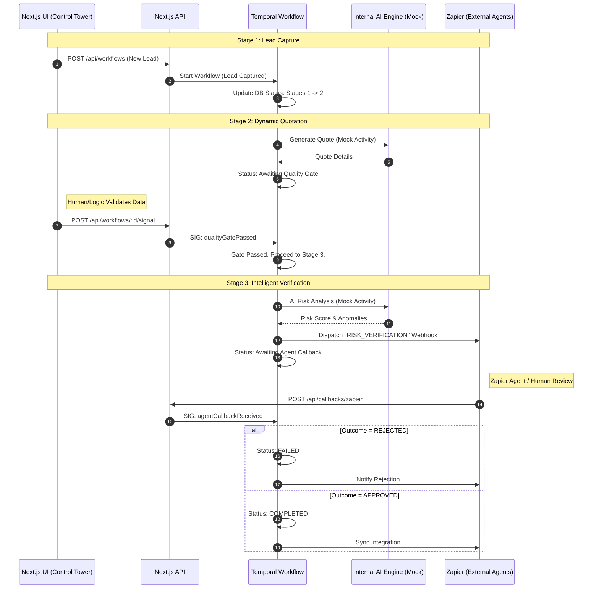

# Event-Driven Intelligence Layer: Process Flow

This document visualizes the "Agentic" architecture implemented in Phase 2. The system decouples state management (Temporal) from task execution (Next.js/Zapier), using signals to coordinate handoffs.

## 1. Process Diagram

## 2. Step-by-Step Process Summary

### Stage 1: Initialization
- **Action**: User creates a lead in the dashboard.
- **System**: Next.js API creates a DB record and immediately starts the Temporal Workflow.
- **State**: Workflow enters `Stage 1` (Lead Capture).

### Stage 2: Dynamic Quotation & Quality Gate
- **Quotation**: The workflow automatically calls the internal Pricing Engine (mocked) to generate a quote.
- **Quality Gate**: The workflow **pauses** execution. It enters a sleep state, waiting for the `qualityGatePassed` signal.
- **Validation**:
  - The Next.js UI/Backend validates the "Facility Application" data (e.g., compulsory fields, Zod schema).
  - Once valid, the API sends the `qualityGatePassed` signal to Temporal.
- **Result**: Workflow wakes up and proceeds to Stage 3.

### Stage 3: Intelligent Verification (The "Agentic" Shift)
- **AI Analysis**: The workflow runs an internal pre-screening (Mock AI) to detect fraud or anomalies in documents.
- **Zapier Dispatch**: The workflow sends a rich payload (Risk Score, Anomalies, Quote) to a specific Zapier Webhook URL.
- **Async Wait**: The workflow **pauses** again, waiting for the `agentCallbackReceived` signal.
- **External Action**:
  - Zapier processes the data.
  - An External Agent (Code or Human) reviews the risk.
  - Zapier posts the result back to `/api/callbacks/zapier`.
- **Callback**: The Next.js API receives the Zapier payload, validates it, and signals the workflow.

### Stage 4: Integration
- **Decision Logic**: The workflow evaluates the Agent's decision.
  - **If Rejected**: Marks workflow as Failed and sends rejection notification.
  - **If Approved**: Marks workflow as Completed and performs final sync.
